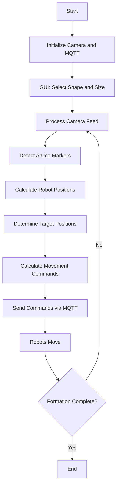

# Multibot Coordinate System Project

## Table of Contents
- [Project Description](#project-description)
- [Features](#features)
- [System Architecture](#system-architecture)
- [Hardware Components](#hardware-components)
- [Software Dependencies](#software-dependencies)
- [Setup Instructions](#setup-instructions)
- [Usage](#usage)
- [Flowchart](#flowchart)
- [ArUco Markers](#aruco-markers)
- [Future Improvements](#future-improvements)
- [Contributing](#contributing)
- [Project Gallery](#project-gallery)

## Project Description
The Multibot Coordinate System Project is an innovative solution designed to control and coordinate multiple robots to form specific shapes or patterns. This system utilizes computer vision techniques, specifically ArUco marker detection, to track the real-time positions of robots and guide them to predefined set points to create desired formations.

The project incorporates a centralized control system that processes visual input from a camera, calculates the positions and orientations of the robots, and sends movement commands to individual robots using MQTT communication protocol. This enables precise and synchronized movement of multiple robots to achieve complex formations.

## Features
- Real-time tracking of multiple robots using ArUco markers
- Formation of various shapes including square, triangle, and line
- Custom shape formation capability
- Graphical User Interface (GUI) for shape and size selection
- MQTT-based communication for robot control
- PID control for precise robot movement
- Live video feed with overlaid tracking information

## System Architecture
The system consists of the following main components:

1. **Camera**: Captures the view of the robot arena
2. **Computer Vision Module**: Processes camera feed to detect ArUco markers
3. **Control Algorithm**: Calculates robot positions and required movements
4. **MQTT Broker**: Facilitates communication between the control system and robots
5. **Robot Units**: Individual robots with ArUco markers, controlled via ESP32 microcontrollers

## Hardware Components
- ESP32 microcontrollers
- ESP32-CAM modules
- Robotic chassis and motors
- Camera (for overhead view)
- ArUco markers

## Software Dependencies
- Python 3.x
- OpenCV
- NumPy
- Paho MQTT
- Tkinter (for GUI)

## Setup Instructions
1. Clone this repository to your local machine.
2. Install the required Python libraries:
   ```
   pip install opencv-python numpy paho-mqtt
   ```
3. Set up the MQTT broker (e.g., Mosquitto) on your network.
4. Configure the ESP32 and ESP32-CAM modules with the provided Arduino code.
5. Attach ArUco markers to your robots.
6. Adjust the camera to have a clear overhead view of the robot arena.

## Usage
1. Run the main Python script:
   ```
   python multibot_control.py
   ```
2. Use the GUI to select the desired shape and size.
3. Click "SET" to initiate the formation process.
4. Monitor the live video feed to observe the robots forming the selected shape.

## Flowchart
For a text-based representation of the flowchart, see below:




## ArUco Markers
ArUco markers are square fiducial markers used for camera pose estimation and robot tracking in our project. Here are examples of the ArUco markers we use:


## Future Improvements
- Implement obstacle avoidance
- Add support for more complex shapes and patterns
- Develop a mobile app for remote control
- Integrate machine learning for adaptive formation strategies

## Contributing
We welcome contributions to the Multibot Coordinate System Project. Please follow these steps to contribute:

1. Fork the repository
2. Create a new branch for your feature
3. Commit your changes
4. Push to the branch
5. Create a new Pull Request

## Project Gallery

### Photos


  
